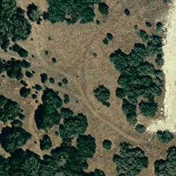
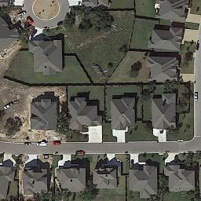
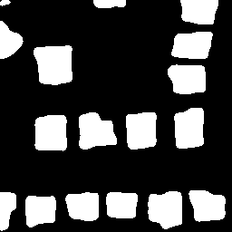
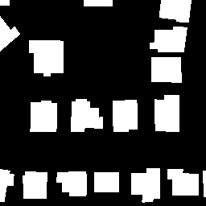

# 基于Paddle复现BIT-CD
## 1.论文简介
BIT-CD: [Remote Sensing Image Change Detection with Transformers](https://arxiv.org/pdf/2103.00208.pdf)

</img>

上图是BIT-CD架构概述。作者通过一个CNN骨干网络（ResNet）从输入图像对中提取高层语义特征，并且使用空间注意力将每个时间特征图转换成一组紧凑的语义tokens。然后使用一个transformer编码器在两个tokens集中建模上下文，得到了富有上下文的tokens被一个连体transformer解码器重新投影到像素级空间，以增强原始像素级特征。最终，作者从两个细化的特征图计算特征差异图像(FDIs)，然后将它们送到浅层CNN以产生像素级变化预测。
。

**参考实现**：https://github.com/justchenhao/BIT_CD


## 2.复现精度

在LEVIR-CD的测试集的测试效果如下表,达到验收指标，F1-Score=89.31%


| Network | opt | epoch | batch_size | dataset | F1-Score |
| --- | --- | --- | --- | --- | --- |
| BIT | SGD  | 200 | 8 | LEVIR-CD | **89.32%** |


每一个epoch的精度和loss可以用visualDL在`output/BIT/vdl_log/vdlrecords.1649902396.log`中查看。

## 3.环境依赖
通过以下命令安装对应依赖
```shell
cd BIT-CD-Paddle/
pip install -r requirements.txt
```

## 4.数据集

下载地址:

[https://aistudio.baidu.com/aistudio/datasetdetail/136610](https://aistudio.baidu.com/aistudio/datasetdetail/136610)

数据集下载解压后,原论文将其剪裁成256*256大小的图像块，没有overlap，使用以下命令生成，需要一段时间
```shell
python data/spliter-cd.py --image_folder ../data/LEVIR-CD --block_size 256 --save_folder ../LEVIR-CD
```
同时需要生成.txt文件用于训练。执行以下命令。

```shell
python data/process_levir_data.py --data_dir ../LEVIR-CD
```


## 5.快速开始

### 模型训练

运行一下命令进行SNUNET模型训练，在训练过程中会对模型进行评估，启用了VisualDL日志功能，运行之后在`output/BIT/vdl_log` 文件夹下找到对应的日志文件

```shell
python tutorials/train/bit_train.py --data_dir=../LEVIR-CD --out_dir=./output/BIT/
```

**参数介绍**：

- data_dir:数据集路径

- out_dir:模型和日志输出文件夹

其他超参数在bit_train.py文件中已经设置好。论文需要训练200epoch收敛，本项目训练在100epoch达到验收指标就停止训练了。


### 模型验证

除了可以再训练过程中验证模型精度，可以使用eval_snunet.py脚本进行测试，权重文件可在[百度云盘下载](https://pan.baidu.com/s/1UU96Deo-fHyVfOfjEiq2ww)，提取码:hfjs 

```shell
python tutorials/eval/change_detection/bit_eval.py --data_dir=../LEVIR-CD/ --weight_path=../output/BIT/best_model/model.pdparams
```
**参数介绍**：

- data_dir:数据集路径

- weight_path:模型权重所在路径

输出如下：

```shell
[04-16 16:52:16 MainThread @logger.py:242] Argv: tutorials/eval/change_detection/bit_eval.py --data_dir=../LEVIR-CD/ --weight_path=../work/output/BIT/best_model/model.pdparams
[04-16 16:52:16 MainThread @utils.py:79] WRN paddlepaddle version: 2.2.2. The dynamic graph version of PARL is under development, not fully tested and supported
2022-04-16 16:52:16 [INFO]	2048 samples in file ../LEVIR-CD/test.txt
W0416 16:52:16.754940  8568 device_context.cc:447] Please NOTE: device: 0, GPU Compute Capability: 7.0, Driver API Version: 10.1, Runtime API Version: 10.1
W0416 16:52:16.759518  8568 device_context.cc:465] device: 0, cuDNN Version: 7.6.
2022-04-16 16:52:19 [INFO]	Loading pretrained model from ../work/output/BIT/best_model/model.pdparams
2022-04-16 16:52:19 [INFO]	There are 203/203 variables loaded into BIT.
2022-04-16 16:52:19 [INFO]	Start to evaluate(total_samples=2048, total_steps=2048)...
OrderedDict([('miou', 0.8980501731845956), ('category_iou', array([0.98892947, 0.80717087])), ('oacc', 0.9894197657704353), ('category_acc', array([0.99300849, 0.91857525])), ('kappa', 0.887736151189675), ('category_F1-score', array([0.99443393, 0.89329779]))])
```
**F1 Score为89.32%**，达到验收标准。

### 模型预测
本项目提供预测脚本`tutorials/predict/change_detection/bit_predict.py`，设置以下参数就可直接运行
- weight 训练好的权重
- A,B, 是T1影像路径,T2影像路径
- pre 预测图片存储的位置

```shell
python tutorials/predict/change_detection/bit_predict.py --A ../LEVIR-CD/test/A/test_2_0_0.png --B ../LEVIR-CD/test/B/test_2_0_0.png --pre ../work/pre.png
```

- 预测结果与真实值对比

| 前时相 | 后时相 | 预测结果 | 真值 |
|---|---|---| --- |
|| || |


**模型导出与部署的README.md[点击此处](./tutorials/infer/README.md)**

### TIPC基础链条测试

该部分依赖auto_log，需要进行安装，安装方式如下：

auto_log的详细介绍参考[https://github.com/LDOUBLEV/AutoLog](https://github.com/LDOUBLEV/AutoLog)。

```shell
git clone https://github.com/LDOUBLEV/AutoLog
pip3 install -r requirements.txt
python3 setup.py bdist_wheel
pip3 install ./dist/auto_log-1.0.0-py3-none-any.whl
```


```shell
bash ./test_tipc/prepare.sh test_tipc/configs/BIT/train_infer_python.txt 'lite_train_lite_infer'

bash test_tipc/test_train_inference_python.sh test_tipc/configs/BIT/train_infer_python.txt 'lite_train_lite_infer'
```

测试结果如截图所示，也可以在`test_tipc/ouput/BIT`文件夹下查看.log文件：

</img>

**TIPC 完整时间戳**


## 6.代码结构与详细说明

```
BIT-CD-Paddle
├── deploy               # 部署相关的文档和脚本
├── docs                 # 整个项目图片
├── output               # 输出的VDL日志
├── data                 # 数据预处理生成.txt代码
├── paddlers  
│     ├── custom_models  # 自定义网络模型代码
│     ├── datasets       # 数据加载相关代码
│     ├── models         # 套件网络模型代码
│     ├── tasks          # 相关任务代码
│     ├── tools          # 相关脚本
│     ├── transforms     # 数据处理及增强相关代码
│     └── utils          # 各种实用程序文件
├── tools                # 用于处理遥感数据的脚本
└── tutorials
      └── train          # 模型训练
      └── eval           # 模型评估和TIPC训练
      └── infer          # 模型推理
      └── predict        # 模型预测


```

## 7.模型信息

| 信息 | 描述 |
| --- | --- |
|模型名称| BIT-CD |
|框架版本| PaddlePaddle==2.2.2|
|应用场景| 遥感图像变化检测 
